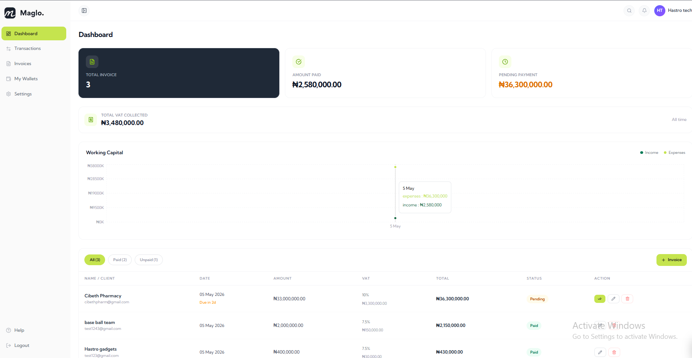

# Maglo Finance

A full-stack invoice management dashboard built with Next.js 15 App Router, Appwrite, and Tailwind CSS v4.



## Features

- **Authentication** — Sign up / sign in with email & password via Appwrite (session cookie, httpOnly)
- **Invoice CRUD** — Create, edit, delete invoices with real-time VAT computation
- **Status management** — Mark invoices as paid, track overdue invoices with countdown
- **Dashboard metrics** — Total invoices, paid, pending, VAT collected
- **Working capital chart** — Income vs expenses over the last 7 days (Recharts)
- **VAT reporting** — Monthly VAT breakdown for paid invoices
- **Responsive layout** — Collapsible sidebar, mobile-first table → card layout

## Tech Stack

| Layer     | Choice                                  |
| --------- | --------------------------------------- |
| Framework | Next.js 15 (App Router, Server Actions) |
| Auth + DB | Appwrite Cloud                          |
| Styling   | Tailwind CSS v4 + shadcn/ui             |
| Forms     | React Hook Form + Zod                   |
| Charts    | Recharts                                |
| Toasts    | react-hot-toast                         |
| Font      | Kumbh Sans                              |

---

## Prerequisites

- Node.js 18.17+
- An [Appwrite Cloud](https://cloud.appwrite.io) account (free tier works)

---

## Appwrite Setup

### 1. Create a project

1. Log in to [cloud.appwrite.io](https://cloud.appwrite.io)
2. Click **Create project** → give it a name (e.g. `finance-dashboard`)
3. Copy the **Project ID** — you'll need it later

### 2. Create a database

1. In your project sidebar go to **Databases** → **Create database**
2. Name it anything (e.g. `maglo-db`)
3. Copy the **Database ID**

### 3. Create a collection

1. Inside the database → **Create collection**
2. Name it `invoices`
3. Copy the **Collection ID**

### 4. Add collection attributes

Go to the **Attributes** tab and add the following (order doesn't matter):

| Attribute Key | Type   | Size | Required | Default  |
| ------------- | ------ | ---- | -------- | -------- |
| `userId`      | String | 36   | —        | —        |
| `client`      | String | 100  | —        | —        |
| `email`       | Email  | —    | —        | —        |
| `amount`      | Double | —    | —        | —        |
| `vat`         | Double | —    | —        | `7.5`    |
| `vatAmount`   | Double | —    | —        | —        |
| `total`       | Double | —    | —        | —        |
| `dueDate`     | String | 10   | —        | —        |
| `status`      | String | 10   | —        | `unpaid` |

### 5. Create a collection index (optional but recommended)

In the **Indexes** tab add:

| Index Key          | Type | Attributes                      |
| ------------------ | ---- | ------------------------------- |
| `userId_createdAt` | Key  | `userId` ASC, `$createdAt` DESC |

### 6. Set collection permissions

In the **Settings** tab → **Permissions**:

- The app uses a server-side API key that bypasses collection permissions, so you can leave the defaults. No client-side SDK is used for data operations.

### 7. Create an API key

1. Go to **Overview** → **Integrations** → **API Keys** → **Create API key**
2. Set an expiry or choose **Never**
3. Under **Scopes**, enable:
   - `documents.read`
   - `documents.write`
   - `documents.delete`
   - `users.read`
   - `sessions.write`
4. Copy the **API Key Secret**

### 8. Add a platform (for web auth)

1. Go to **Overview** → **Integrations** → **Platforms** → **Add platform** → **Web**
2. Set hostname to `localhost` for development
3. For production add your actual domain

---

## Local Setup

### 1. Clone and install

```bash
git clone https://github.com/your-username/maglo.git
cd maglo
npm install
```

### 2. Configure environment variables

Create a `.env.local` file in the project root:

```env
# Appwrite — public (safe to expose to browser)
NEXT_PUBLIC_APPWRITE_ENDPOINT=https://cloud.appwrite.io/v1
NEXT_PUBLIC_APPWRITE_PROJECT_ID=your_project_id_here

# Appwrite — secret (server-side only, never exposed to browser)
APPWRITE_API_KEY=your_api_key_secret_here

# Appwrite — database
APPWRITE_DATABASE_ID=your_database_id_here
APPWRITE_COLLECTION_ID=your_collection_id_here
```

### 3. Run the development server

```bash
npm run dev
```

Open [http://localhost:3000](http://localhost:3000). You'll be redirected to `/login`.

---

## Project Structure

```
├── actions/
│   ├── auth.actions.ts        # signUp, signIn, signOut Server Actions
│   └── invoice.actions.ts     # CRUD Server Actions (Appwrite DB)
├── app/
│   ├── (auth)/
│   │   ├── login/page.tsx
│   │   └── signup/page.tsx
│   ├── (dashboard)/
│   │   ├── layout.tsx         # Auth guard (second gate) + DashboardShell
│   │   ├── dashboard/page.tsx # Metrics, chart, recent invoices
│   │   └── invoices/
│   │       ├── page.tsx       # Full invoice list
│   │       └── [id]/page.tsx  # Invoice detail
│   ├── layout.tsx             # Root layout (font, toaster)
│   └── page.tsx               # Root redirect → /dashboard
├── components/
│   ├── dashboard/
│   │   ├── MetricsCard.tsx
│   │   └── WorkingCapitalChart.tsx
│   ├── invoices/
│   │   ├── InvoiceForm.tsx    # Create / edit modal (RHF + Zod)
│   │   ├── InvoiceTable.tsx   # Filterable table with CRUD actions
│   │   └── VatSummary.tsx
│   └── ui/layout/
│       ├── DashboardShell.tsx # Sidebar + Topbar wrapper
│       ├── Sidebar.tsx
│       └── Topbar.tsx
├── lib/
│   ├── appwrite-error.ts      # Appwrite error → user-friendly string
│   ├── appwrite-server.ts     # Admin client + session client
│   ├── utils.ts               # cn() helper
│   └── validations.ts         # Zod schemas
├── middleware.ts              # Edge auth guard (first gate)
└── types/
    └── invoice.ts
```

---

## Auth Flow

```
Request
  │
  ▼
middleware.ts          ← checks appwrite-session cookie
  │  no session?       → redirect /login
  │  session + public? → redirect /dashboard
  ▼
app/(dashboard)/layout.tsx   ← re-verifies session server-side
  │  session invalid?  → redirect /login
  ▼
Page renders
```

---

## Known Limitations / TODOs

- **Invoice PDF download** — The Download button on the detail page is a placeholder. Integrate a library like `@react-pdf/renderer` or a headless-browser endpoint to generate PDFs.
- **Invoice preview** — Similarly, Preview is not yet wired up.
- **Send Invoice** — Email sending (e.g. via Resend or Appwrite Functions) is not implemented.
- **Transactions / Wallets / Settings** — Sidebar links exist but pages are not built yet.
- **Pagination** — `getInvoices` fetches up to 100 documents. Add Appwrite cursor-based pagination for larger datasets.

---

## Deployment (Vercel)

1. Push to GitHub
2. Import the repo on [vercel.com](https://vercel.com)
3. Add all environment variables from `.env.local` in the Vercel project settings
4. Add your Vercel domain as a **Web Platform** in Appwrite (same step as localhost above)
5. Deploy

---

## Scripts

```bash
npm run dev      # Start dev server (http://localhost:3000)
npm run build    # Production build
npm run start    # Start production server
npm run lint     # ESLint
```
